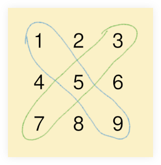

# Diagonal Difference

- [Diagonal Difference on HackerRank](https://www.hackerrank.com/challenges/diagonal-difference)

This is a classic matrix problem.
The “diagonal difference” is just the easy part (a subtraction).
The main challenge here is to sum the diagonals of the given square matrix.

```text

1     2     3

4     5     6

7     8     9

```



Basically, our goal is to sum 1, 5 and 9 from the right to left diagonal, 3, 5 and 7 from the left to right diagonal, and perform the subtraction.

## JavaScript

### Solution 1 with nested loops

```javascript
/**
 * T.C: O(n²).
 * S.C: O(1).
 */
function diagDiff(sqrMatrix) {
  const len = sqrMatrix.length;
  let ltrDiag = 0;
  let rtlDiag = 0;

  for (let i = 0; i < len; i++) {
    for (let j = 0; j < len; j++) {
      if (i === j)
        ltrDiag += sqrMatrix[i][j];

      if (i + j === len - 1)
        rtlDiag += sqrMatrix[i][j];
    }
  }

  return Math.abs(ltrDiag - rtlDiag);
};
```

The time complexity is $O(n^2)$ because of the nested looping.
