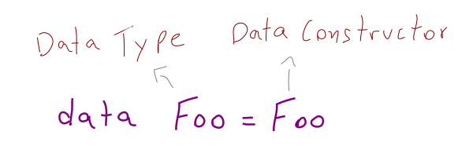

# Data Types

To create a new Data Type we use the `data` keyword:

```haskell
data Foo = Foo

x :: Foo
x = Foo
```



The type `Foo` has one inhabitant, `Foo`.

We can use the same name on the left, as the Data Type, and on the right as the Data Constructor because they are stored in different namespaces.

## Product and Coproduct types

If some type can be either one or the other, but not both, it is a *coproduct* (sum type), also called *union* types. In Set Theory, an *union* operation is an “OR” operation.

The “hello world” of data types is defining our own version of true and false:

```haskell
data Bool = T | F

f :: Bool
f = F

t :: Bool
t = T
```

`Bool` is the *data type* and `T` and `F` are the *data constructors*.

A given `v :: Bool` can be either `F` **or** `T` but not both at the same time. In Set Theory, a *union* is an *OR* operation, generally denoted by `|` or `||` in programming languages.

```haskell
data ReasonToCancel
  = TooManyEmails
  | NotInterested
  | Other String

answer :: ReasonToCancel
answer = Other "I don't like email adds..."
```

The data constructor `Other` in `ReasonToCancel` data type is actually a function which implies:

```haskell
Other :: String -> ReasonToCancel
```

That is, the “function” `Other` is a function from `String` to `ReasonToCancel`. It maps one type to another.


## Type Variables

We can make the `Other` data constructor take a type we don't know yet, instead of hard-coding it as `String`:

```haskell
data WhyCancel a -- <1>
  = TooManyEmails
  | NotInterested
  | Other a -- <2>

becauseWithString :: WhyCancel String -- <3>
becauseWithString = Other "I don't like email ads."

type Reason = { code :: Int, text :: String }

becauseWithReason :: Reason -- <4>
becauseWithReason =
  { code: 7
  , text: "I don't like ads."
  }
```

Note the `a` **type variable** in 1 and 2. It means when we type something as `WhyCancel`, it takes a *type variable*, that is, some type, which is what we do in 3 and 4.

## :kind

As explained in the book Haskell From First Principles

> Kinds are types one level up.

In other words, *kinds* are types of types. Try this in the REPL:

```haskell-repl
> import WhyCancel

> :kind WhyCancel
Type -> Type

> :kind WhyCancel Int
Type
```

In the first case, we get `Type -> Type`, which means `WhyCancel` is not fully realised; it still requires some type to produce the final (concrete, realised) type. In the second case, we get `Type`, which means it has been fully realised and we are at a final, concrete type.

We can, of course, create a type alias for it:

```haskell-repl
> type T = WhyCancel String
> :kind T
Type
```

## More examples

```haskell
data Thing
  = Foo
  | Bar
  | Sth String

sth :: Thing
sth = Sth "Takes a String"
```

`Thing` is the data type, and `Foo`, `Bar` and `Sth` are data constructors. The data constructor `Sth` takes `String`. Now, consider this:

```haskell
type Jedi = { id :: Int, name :: String }

data Thing a
  = Foo
  | Bar
  | Sth a

sthStr :: Thing String
sthStr = Sth "a string"

sthInt :: Thing Int
sthInt = Sth 1

sthJedi :: Thing Jedi
sthJedi = Sth { id: 1, name: "Ahsoka Tano" }
```

By making `Thing` take a *polymorphic type variable*, we can construct data of different types.

