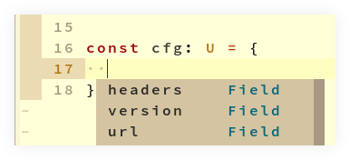

# Intersection Types

## Introduction to Intersection Types

Intersection types are created with the `&` operator.
Intersection behaves differently if used with literal types vs object types.
The `&` operator behaves like an _and_ operation for literal types, but as an _union_  operation for object types.

### Intersection of non non-object types

```typescript
type T = string & number;
// type T = never
```

The resulting type is `never` because `T` cannot possibly be both `string` **and** `number`.
In this case, the name “intersection” makes sense.
There is no intersection between `string` **and** `number`.

### Intersection of object types

However, this creates an _union_ of the type constituents:

```typescript
type BaseConfig = {
  url: string;
  version: number;
}

type U = BaseConfig & { headers: Record<string, string> };
// type U = BaseConfig & {
//     headers: Record<string, string>;
// }
```



It is as if we had done this:

```typescript
type U = {
  url: string;
  version: number;
  headers: Record<string, string>;
};
```

In this case, `&` really behaves like an _union_ of the type constituents, not like an _intersection_.
